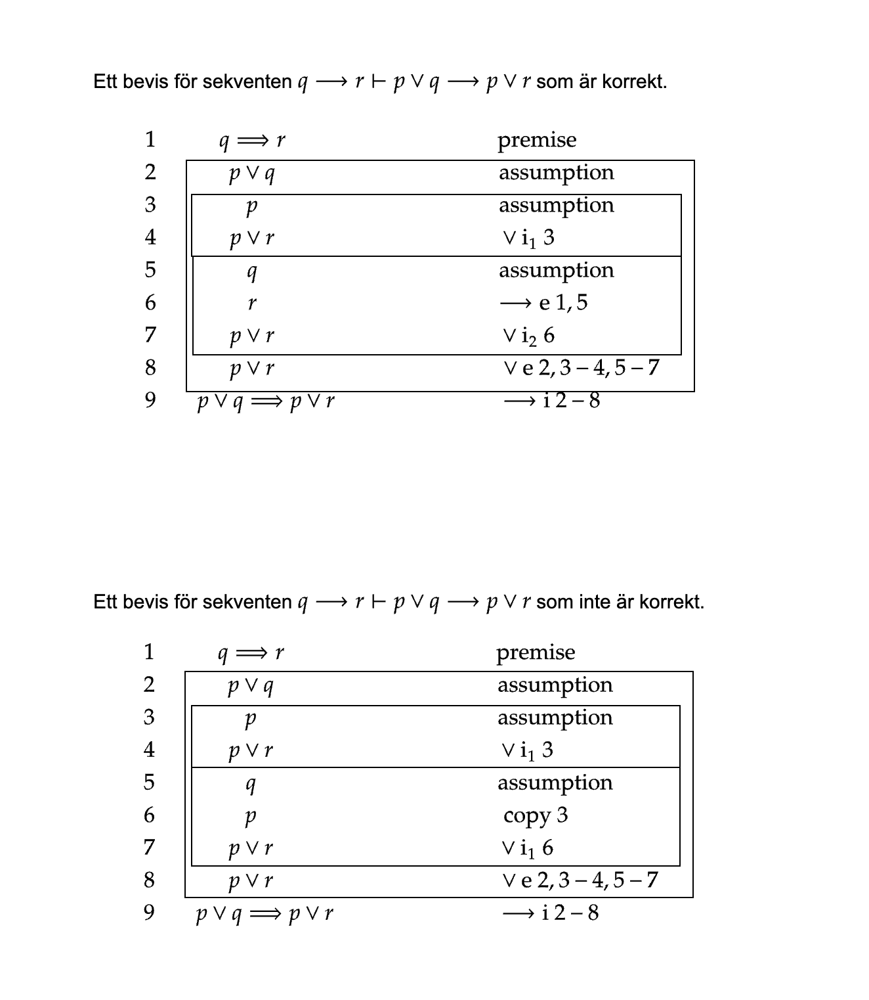

\
\
\
\
\
\

# $~~~~~~~~~~~~~~~~~$Beviskontroll med Prolog

;

# $~~~~~~~~~~~~~~~~~~~~~~~$Grupp Lumon 
$~~~~~~~~~~~~~~~~~~~~~~~~~~~$Ludwig Berglind, Simon Severinsson

\pagebreak

## Beskrivning av algoritmen 
Programmet öppnar och läser in en fil med bevis genom ett filnamn och sparar sedan de första tre raderna av beviset i tre olika variabler som benämns Prems (en lista av alla premisser), Goal (slutsatsen eller högerledet av sekventen) samt Proof (en lista med listor för hela beviset med alla rader och boxar).
Dessa variabler tas sedan in som argument i validProof\3. Där kollas först att den sista raden i beviset är slutsatsen och att sista raden inte är ett antagande vilket görs genom att rekursivt traversera genom hela beviset.
Sedan kallas predikatet checkSteps\4 där beviset faktiskt valideras. checkSteps\4 tar in premisserna, slutsatsen, hela beviset, samt hela beviset uppdelat i huvud och svans. Här valideras varje rad i beviset rekursivt genom att kolla om den är en premiss, en ny låda, eller om den stämmer in på någon av de andra reglerna. Svansen läggs sedan in i checkSteps\4 och basfallet nås när svansen är tom, dvs. när hela beviset har kollats igenom.

För att kolla om en rad är en premiss används predikatet checkPrems\2 som tar in en rad från beviset och en listan med alla premisser. Sedan används det inbyggda member\2-predikatet för att se till att formeln i raden faktiskt är en premiss.

För alla andra regler används predikatet checkRule\2 som tar in en rad från beviset och en lista över alla rader i beviset. I samtliga checkRule-klausuler kontrolleras det att ingen regel använder sig av senare rader genom checkLines-predikaten. Sedan kollas det om raderna som hänvisas till i reglerna på varje rad finns med i beviset genom member\2-predikatet.
Vissa regler använder sig av boxar. Genom att kolla om den specifika raden i en lista med wildcard-svans finns i beviset kan vi konstatera att den är början av en box. Samma lista med svans kan sedan också läggas in i boxLast\3-predikatet för att kontrollera att även den sista raden i boxen existerar. boxLast\3 traverserar rekursivt till sista elementet/raden i listan och kollar att radnummer och formel stämmer överens med regeln.
LEM-regeln använder inte någon member-kontroll utan kollar endast att innehållet på raden är en eller relation mellan någon variabel och dess negation samt att lem-regeln används.

När hela beviset rekursivt har traverserats uppifrån och ner nås basfallet och programmet backtrackar hela vägen till validProof\3.

Boxhanteringen:

Boxar hanteras genom predikatet newBox\3 som kollar att första raden i boxen är ett antagande och sedan kallas predikatet checkSteps med boxens svans ([_|T]) och en lista med hela beviset, där alla rader som inte är boxar lätt kan läsas genom member\2-predikatet, som appendats med boxens rader. Boxens rader valideras sedan en i taget rekursivt tills dess att svansen tar slut och man backtrackas ut ur newBox-predikatet och kallar checkSteps med den vanliga bevislistan med rader utan boxar igen.

| Predikat  | Sant      | Falskt    |
| --------- | --------- | --------- |
| verify/1  | Då beviset stämmer (validProof = true) |Då beviset inte stämmer (validProof är false), eller inläsning av misslyckas |
| | | |
| validProof\3 | Då last(Proof, Goal) = true och checkSteps stämmer. | Då last(Proof, Goal) = false eller checkSteps inte stämmer |
| | | |
| checkSteps\4 | Då last(Proof, Goal) = true och checkSteps stämmer. | Då beviset inte stämmer (validProof är false), eller inläsning av misslyckas |
| | | |
| newBox\3 | Då första linjen i en ny låda är en assumption, och checkSteps på all efterföljande linjer i lådan stämmer. | Då första linjen i en ny låda inte är en assumption, och checkSteps på någon av efterföljande linjer inte lådan stämmer. |
| | | |
| last\2 | Då första linjen i en ny låda är en assumption, och checkSteps på all efterföljande linjer i lådan stämmer. | Då första linjen i en ny låda inte är en assumption, och checkSteps på någon av efterföljande linjer inte lådan stämmer. |
| | | |
| boxLast\3 | Då sista raden i en låda har rätt radnummer och rätt formel. | Då sista raden i en låda inte har rätt radnummer eller formel. |
| | | |
| checkPremise\2 | Då formeln är en premiss och finns med i vänsterled av sekventen. | Då formeln inte är en premiss och således inte finns med i vänsterled av sekventen. |
| | | |
| checkRule\2 | Då regeln som används är korrekt och relaterar till tidigare korrekta rader som finns med i beviset. | Då regeln som används inte stämmer eller inte relaterar till tidigare korrekta rader, eller relaterar till rader som inte är en del av beviset. |
| | | |
| checkLines\2 | Då raderna som används i en viss regel dyker upp före den aktuella raden där regeln används | Då raderna som används i en viss regel dyker upp efter den aktuella raden där regeln används |
| | | |
| checkLines\3 | Då raderna som används i en viss regel dyker upp före den aktuella raden | Då raderna som används i en viss regel dyker upp efter den aktuella raden där regeln används |
| | | |
| checkLines\5 | Då raderna som används i en viss regel dyker upp före den aktuella raden | Då raderna som används i en viss regel dyker upp efter den aktuella raden där regeln används |

\pagebreak

### Appendix A - code

```
% Read input file, and check the proof

verify(InputFileName) :-
	see(InputFileName),
	read(Prems), read(Goal), read(Proof),
	seen,
	validProof(Prems, Goal, Proof).

validProof(Prems, Goal, Proof) :-
	last(Proof, Goal),
	checkSteps(Prems, Goal, Proof, Proof).

% Base step
checkSteps(_, _, [], _).

% Recursively go through every row of the proof from top to bottom 
% and check what Rule is used and if it is correct.
checkSteps(Prems, Goal, [Line|Rest], Proof) :-
	(checkPremise(Line, Prems) ;
	checkRule(Line, Proof) ;
	newBox(Prems, Line, Proof)),
	checkSteps(Prems, Goal, Rest, Proof).


% Check box
newBox(Prems, [BoxStart|BoxTail], Proof) :-
	BoxStart = [_ , _, assumption],
	append([BoxStart|BoxTail], Proof, ProofWBox),
	checkSteps(Prems, _, BoxTail, ProofWBox).


% Traverse to last element and check if it is the same as Goal
last([[_, Goal, Rule]], Goal) :-
	Rule \= assumption.

last([_|Rest], Goal) :-
	last(Rest, Goal).

% Traverse to last element and check if it has the correct ending 
% according to rules
boxLast([[RowB, VarY, _]], VarY, RowB).

boxLast([_|T], VarY, RowB) :-
	boxLast(T, VarY, RowB).

%%%%%%%%%%%%%%%%%%%%%%%%%%%%%%%%%%%%%%%%%%%%%%

% Premise rule, premise
checkPremise([_, X, premise], Prems) :-
	member(X, Prems).

% And introduction, andint
checkRule([LineNum, and(X, Y), andint(A, B)], Proof) :-
	checkLines(LineNum, A, B),
	member([A, X, _], Proof),
	member([B, Y, _], Proof).

% Or introduction 1, orint1
checkRule([LineNum, or(X, _), orint1(A)], Proof) :-
	checkLines(LineNum, A),
	member([A, X, _], Proof).

% Or introduction 2, orint2
checkRule([LineNum, or(_, Y), orint2(B)], Proof) :-
	checkLines(LineNum, B),
	member([B, Y, _], Proof).

% Implication introduction, impint
checkRule([LineNum, imp(X, Y), impint(A, B)], Proof) :-
	checkLines(LineNum, A, B),
	member([[A, X, assumption]|Box], Proof),
	boxLast([[A,X,_]|Box], Y, B).

% Negation introduction, negint
checkRule([LineNum, neg(X), negint(A, B)], Proof) :-
	checkLines(LineNum, A, B),
	member([[A, X, assumption]|Box], Proof),
	boxLast([[A,X,_]|Box], cont, B).

% And elimination 1, andel1
checkRule([LineNum, X, andel1(A)], Proof) :-
	checkLines(LineNum, A),
	member([A, and(X,_), _], Proof).

% And elimination 2, andel2
checkRule([LineNum, Y, andel2(B)], Proof) :-
	checkLines(LineNum, B),
	member([B, and(_,Y), _], Proof).

% Implication elimination, impel
checkRule([LineNum, X, impel(A, B)], Proof) :-
	checkLines(LineNum, A, B),
	member([A,Y,_], Proof),
	member([B, imp(Y,X), _], Proof).

% Or elimination, orel
checkRule([LineNum, X, orel(A, B, C, D, E)], Proof) :-
	checkLines(LineNum, A, B, C, D, E),
	member([A, or(U,V), _], Proof),
	member([[B, U, assumption]|Box], Proof),
	boxLast([[B,U,_]|Box], X, C),
	member([[D, V, assumption]|Box2], Proof),
	boxLast([[D,V,_]|Box2], X, E).

% Negation elimination, negel
checkRule([LineNum, cont, negel(A, B)], Proof) :-
	checkLines(LineNum, A, B),
	member([A,X,_], Proof),
	member([B, neg(X), _], Proof).

% Falsum elimination, contel
checkRule([LineNum, _, contel(A)], Proof) :-
	checkLines(LineNum, A),
	member([A, cont, _], Proof).

% double negation introduction,  negnegint
checkRule([LineNum, neg(neg(X)), negnegint(A)], Proof) :-
	checkLines(LineNum, A),
	member([A,X,_], Proof).

% double negation elimination, negnegel
checkRule([LineNum, X, negnegel(A)], Proof) :-
	checkLines(LineNum, A),
	member([A, neg(neg(X)), _], Proof).

% MT
checkRule([LineNum, neg(X), mt(A,B)], Proof) :-
	checkLines(LineNum, A, B),
	member([A, imp(X, Y), _], Proof),
	member([B, neg(Y), _], Proof).

% PBC
checkRule([LineNum, X, pbc(A,B)], Proof) :-
	checkLines(LineNum, A, B),
	member([[A, neg(X), _]|Box], Proof),
	boxLast([[A, neg(X), _]|Box], cont, B).

% Copy
checkRule([LineNum, X, copy(A)], Proof) :-
	checkLines(LineNum, A),
	member([A, X, _], Proof).

% LEM
checkRule([_, or(X, neg(X)), lem],_).


% Check so no rule calls for rows that are defined after the 
% current row
checkLines(Num, A) :-
	Num > A.
checkLines(Num, A, B) :-
	Num > A,
	Num > B.
checkLines(Num, A, B, C, D, E) :-
	Num > A,
	Num > B,
	Num > C,
	Num > D,
	Num > E.
```

\pagebreak

### Appendix B - one correct and one incorrect proof


```
[imp(q, r)].

imp(or(p, q), or(p, r)).

[
	[1, imp(q, r), premise],
	[
		[2, or(p, q), assumption],
		[
			[3, p, assumption],
			[4, or(p, r), orint1(3)]
		],
		[
			[5, q, assumption],
			[6, r, impel(5, 1)],
			[7, or(p, r), orint2(6)]
		],
		[8, or(p, r), orel(2,3,4,5,7)]
	],
	[9, imp(or(p, q), or(p, r)), impint(2, 8)]
].
%%%%%%%%%%%%%%%%%%%%%%%%%%%%%%%%%%
[imp(q, r)].

imp(or(p, q), or(p, r)).

[
	[1, imp(q, r), premise],
	[
		[2, or(p, q), assumption],
		[
			[3, p, assumption],
			[4, or(p, r), orint1(3)]
		],
		[
			[5, q, assumption],
			[6, p, copy(3)],
			[7, or(p, r), orint1(6)]
		],
		[8, or(p, r), orel(2,3,4,5,7)]
	],
	[9, imp(or(p, q), or(p, r)), impint(2, 8)]
].
```
